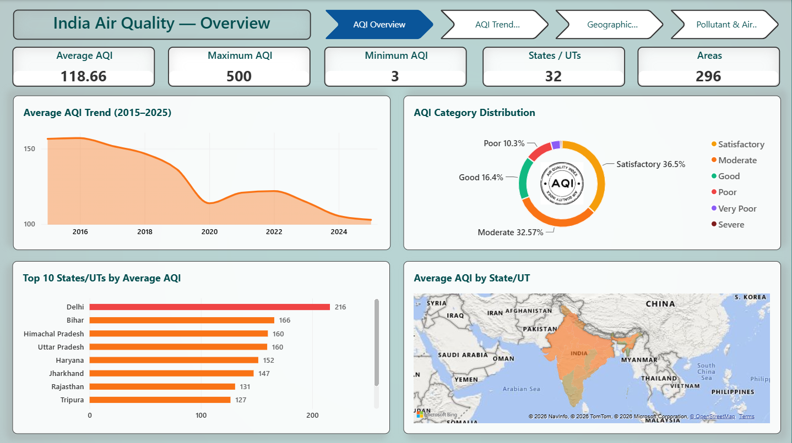
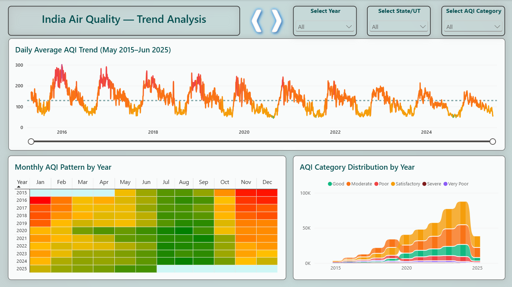
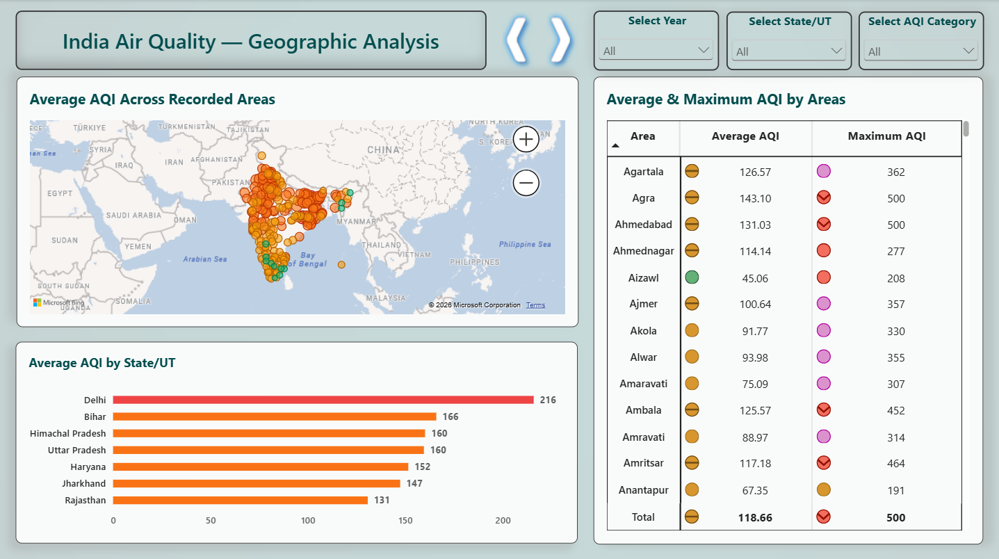
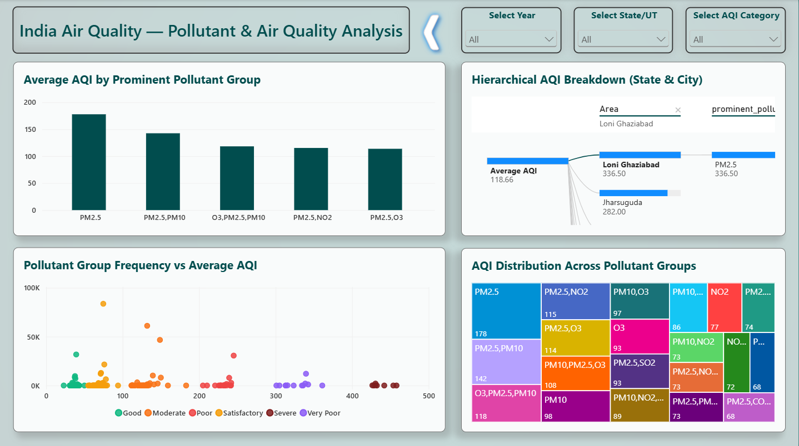

# 🌍 AQI Analysis using Power BI

## 📌 Project Overview

This project focuses on analyzing **Air Quality Index (AQI)** data using **Microsoft Power BI**. The dashboard provides an interactive way to understand air quality conditions across different locations and analyze the major pollutants affecting air quality.

The project uses data from **CPCB / data.gov.in** and presents the analysis through interactive visualizations, maps, slicers, tooltips, and page navigation.

## 🎯 Objectives

* Analyze AQI levels across different locations.
* Compare air quality between states and cities.
* Identify areas with different AQI categories.
* Analyze major air pollutants.
* Identify patterns and trends in air quality.
* Build an interactive and user-friendly Power BI dashboard.

## 🛠️ Tools & Technologies

* **Microsoft Power BI**
* **Power Query** – Data cleaning and transformation
* **DAX** – Calculations and measures
* **Data Visualization**
* **CSV / Excel** – Data source

## 📊 Dashboard Pages

### Page 1 – AQI Overview

Provides an overall summary of the AQI data using key indicators and visualizations. It helps users understand the general air quality situation.

### Page 2 – Geographical Analysis

Analyzes AQI across different states and locations using geographical visualizations and interactive filters.

### Page 3 – AQI Category Analysis

Explores AQI categories and their distribution across different locations. Interactive slicers and tooltips allow users to analyze specific AQI conditions.

### Page 4 – Pollutant Analysis

Focuses on major pollutants and their contribution to air-quality conditions. It helps identify which pollutants are more prominent in different locations.

## 🔍 Key Features

* Interactive AQI analysis
* State and city-level analysis
* AQI category filtering
* Geographical map visualization
* Pollutant analysis
* Interactive slicers
* Custom tooltips
* Page navigation
* Next/Previous page buttons
* Dynamic visual interactions

## 📂 Project Structure

```text
AQI-Analysis-PowerBI/
│
├── AQI_Analysis.pbix
│
├── Screenshots/
│   ├── Page1.png
│   ├── Page2.png
│   ├── Page3.png
│   └── Page4.png
│
├── Documentation/
│   └── AQI_Project_Report.pdf
│
├── Dataset/
│   └── AQI_Dataset.csv
│
└── README.md
```

## 📷 Dashboard Preview

### Page 1 – AQI Overview



### Page 2 – Geographical Analysis



### Page 3 – AQI Category Analysis



### Page 4 – Pollutant Analysis



## 📚 Data Source

The AQI dataset used for this project is based on publicly available air-quality data from **Central Pollution Control Board (CPCB) / data.gov.in**.

## 👨‍💻 Project Type

**Academic Mini Project – Data Analytics & Visualization**

**Domain:** Air Quality Analysis

**Tool:** Microsoft Power BI
